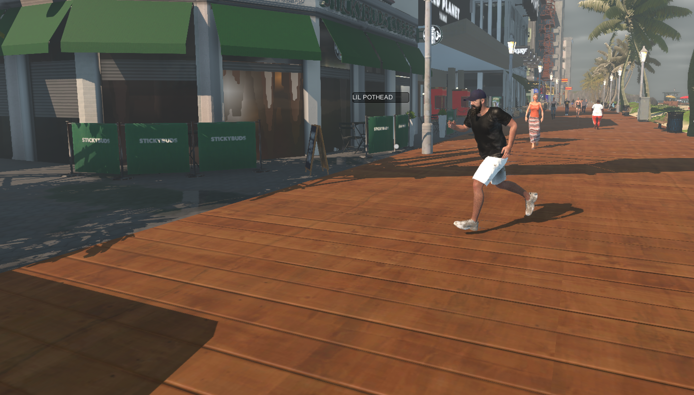
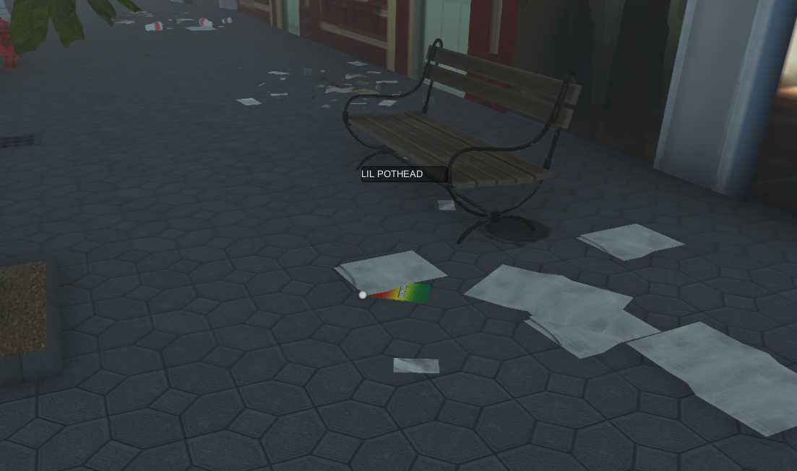
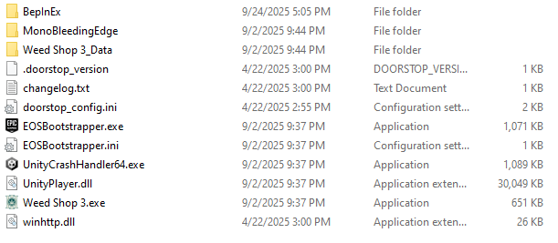

# TrashCardFinder
A simple mod that looks for the **Lil’ Pothead collectible card** in your current save.

- If a card is found, you’ll see an on-screen marker pointing to it.
- If no card spawned for this save, you’ll get a pop-up message, and the mod goes idle (no hitching/lag).

---

## Install

### 1) Install BepInEx 5 (Mono)

Download from the official releases:  
<https://github.com/BepInEx/BepInEx/releases>

> **Grab “BepInEx x64 (Mono)”** (not IL2CPP).

### 2) Extract into the game folder

Extract the zip into the same folder as `Weed Shop 3.exe`. You should end up with files like:

- `BepInEx/`
- `winhttp.dll`
- `doorstop_config.ini`
- `.doorstop_version`
- `changelog.txt`

**Example layout:**

### 3) Run the game once, Load in a game, Exit Game

This lets BepInEx finish creating its folders.

### 4) Install the mod

Download the CardFinder folder, extract and place the folder in BepInEx/plugins:
- You don't need to download the .cs or .csproj files in this repo. I just have them here to show my source code.

### 5) Launch the game

On load, the mod waits for the scene to be ready, scans briefly, and:

- shows **“LIL POTHEAD CARD”** pointing to the card, **or**
- shows a small dialog if no card spawned in this save.

---

## How to use

- Load your save. If a card exists, follow the UI label/arrow to it.
- If a dialog says none spawned, **save, exit to menu, and reload** to roll a new spawn.
- The mod idles after success **or** after a no-spawn result to avoid hitching.

---

## Uninstall

Delete: You can just remove the CardFinder folder with the .dll file once you get the reward for finding the cards, or the contents of the BepInEx folder. I would keep BepInEx and the contents if you plan on using mods in the future.

---

## Troubleshooting

- **Wrong BepInEx build** → Use **BepInEx x64 (Mono)** (not IL2CPP).
- **Wrong game folder** → `winhttp.dll` must sit next to `Weed Shop 3.exe`.
- **No `plugins` folder** → Run the game once after installing BepInEx.
- **No overlay appears** → Some saves simply don’t spawn a card—follow the dialog and reload.
- **Performance concerns** → The mod scans for a short window, then idles; it won’t loop forever.

---

## Credits

- Built with BepInEx 5.
- Thanks to the Weed Shop 3 community.

